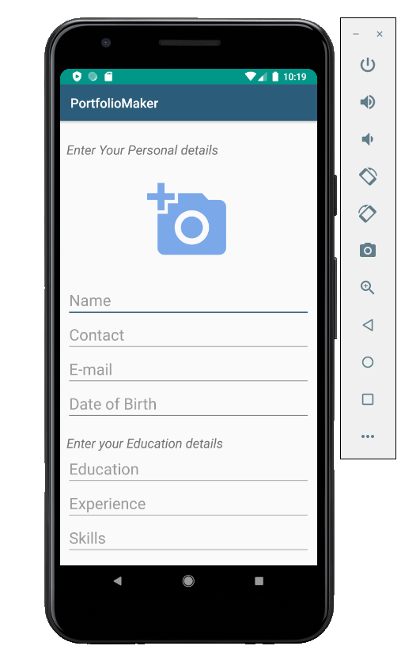
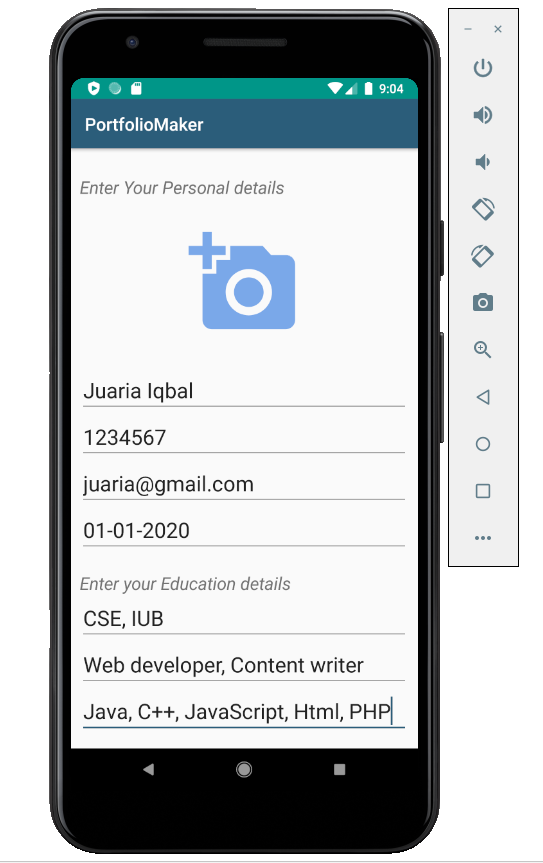
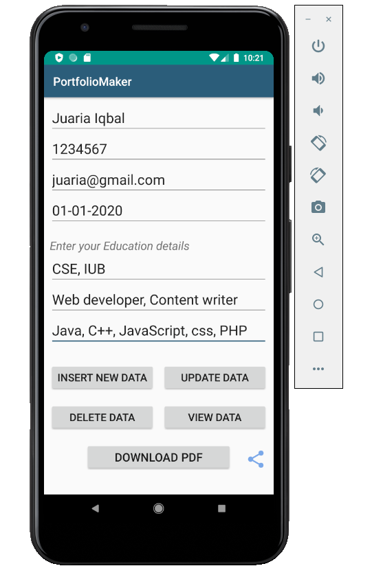
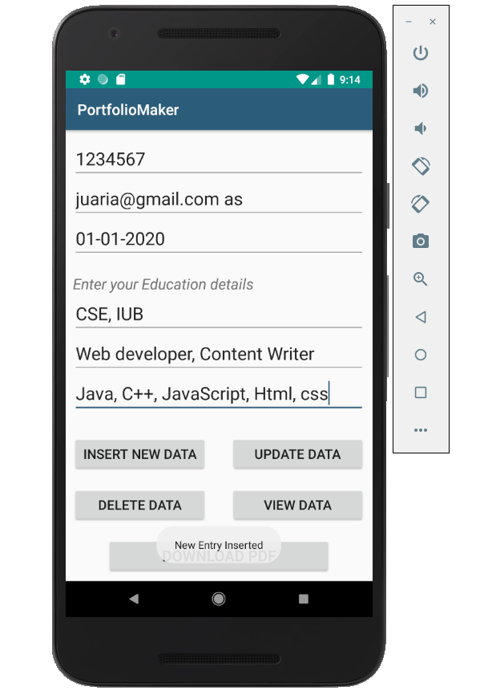
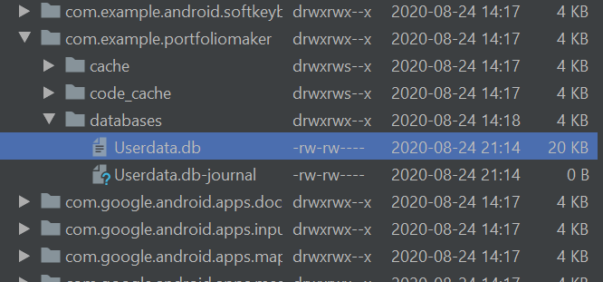
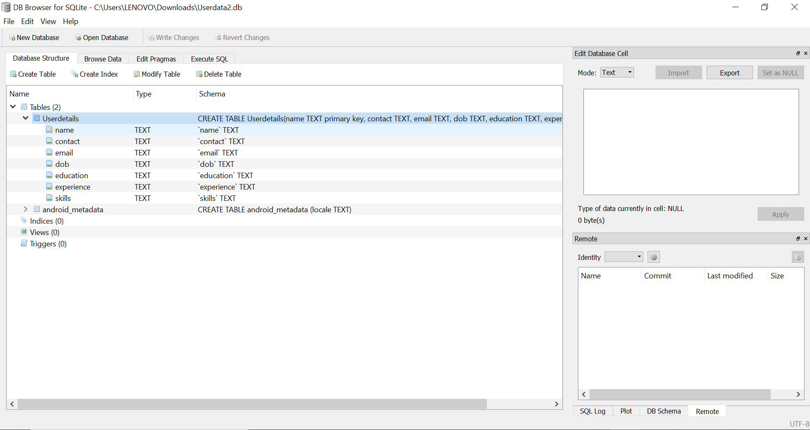
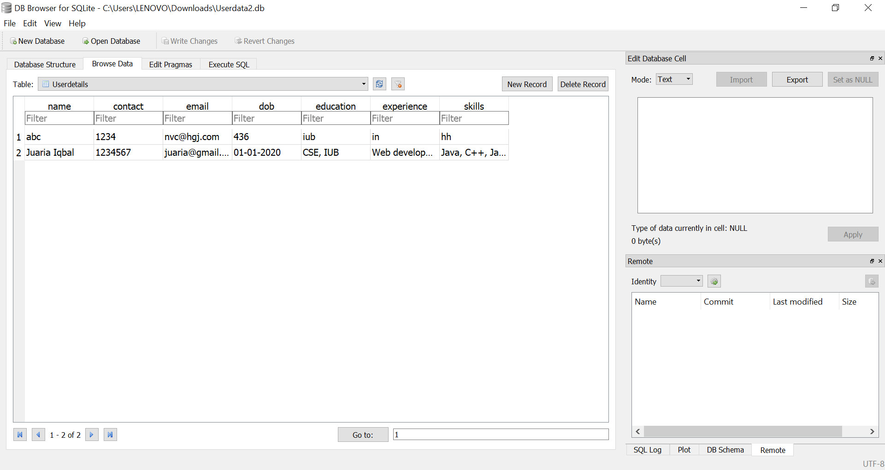

# PortfolioMaker
An android app to automatically generate a portfolio from user inputs.

The images below shows the steps of the purpose of this application:
       

All the user infromation from input is stored in database using the "insert New Data" button. The data can be updated, deleted or can viewed as well.

The images below shows the database table of the users:

Finally, A pdf of the portfolio can be genereted after pressing the "Download PDF" button.
The image below is an example of basic portfolio pdf.

End
